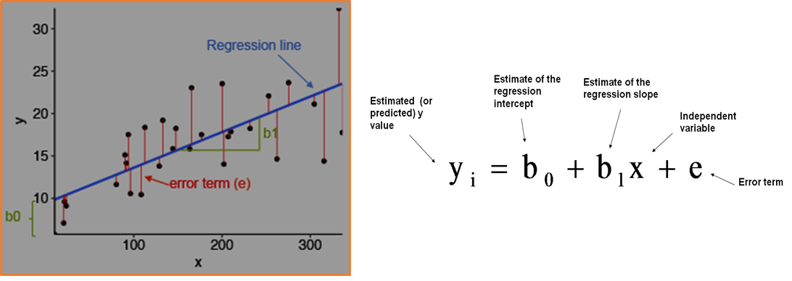

# Linear Regressions


- you need regression to answer whether and how some phenomenon influences the other or how several variables are related. For example, you can use it to determine if and to what extent the experience or gender impact salaries.

- Regression is also useful when you want to forecast a response using a new set of predictors. For example, you could try to predict electricity consumption of a household for the next hour given the outdoor temperature, time of day, and number of residents in that household.

## Simple Linear Regression

Simple linear regression is the simplest case of linear regression with a single independent variable.



- you can use scikit learn to perform linear regression. **Scikit-learn** is a powerful Python module for machine learning. It contains function for regression, classification, clustering, model selection and dimensionality reduction. Today, I will explore the sklearn.linear_model module which contains “methods intended for regression in which the target value is expected to be a linear combination of the input variables”.

## When Do You Need Regression?

Typically, you need regression to answer whether and how some phenomenon influences the other or how several variables are related. For example, you can use it to determine if and to what extent the experience or gender impact salaries.

- Regression is also useful when you want to forecast a response using a new set of predictors. For example, you could try to predict electricity consumption of a household for the next hour given the outdoor temperature, time of day, and number of residents in that household.

- Regression is used in many different fields: economy, computer science, social sciences, and so on. Its importance rises every day with the availability of large amounts of data and increased awareness of the practical value of data.

- Linear regression is probably one of the most important and widely used regression techniques. It’s among the simplest regression methods. One of its main advantages is the ease of interpreting results.

## How to Run Linear Regression in Python


- you can do linear regression using numpy, scipy, stats model and sckit learn.
- Scikit-learn is a powerful Python module for machine learning.
- Scikit has functions for regression, classification, clustering, model selection and dimensionality reduction.
- Imports:
	```
	Import scipy.stats as stats 
	Import sklearn
	```
- convert boston.data into a pandas data frame:
	```
	bos = pd.DataFrame(boston.data)  
	bos.head()
	```
- Import linear regression:
	```
	From sklearn.linear_model import LinearRegression
	```
- Type LinearRegression and the press <tab> key to get a list of functions available inside linear regression object.
	
- Some important functions when fitting linear regression model:
	```
	lm.fit() -> fits a linear model
	lm.predict() -> Predict Y using the linear model with estimated coefficients
	lm.score() -> Returns the coefficient of determination (R^2). A measure of how well observed outcomes are replicated by the model, as the proportion of total variation of outcomes explained by the model.
	```
- Create a scatter plot: plt.scatter(X, Y)
- Scikit learn provides a function called train_test_split:  divide your data sets randomly. 
- Residual plots are a good way to visualize the errors in your data.


