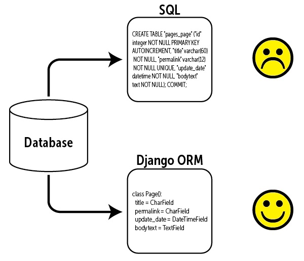

# Django Models

***A Django model*** is the built-in feature that Django uses to create tables, their fields, and various constraints. In short, Django Models is the SQL of Database one uses with Django. SQL (Structured Query Language) is complex and involves a lot of different queries for creating, deleting, updating or any other stuff related to database. Django models simplify the tasks and organize tables into models. Generally, each model maps to a single database table. 
Moreover, we can use admin panel of Django to create, update, delete or retrieve fields of a model and various similar operations. Django models provide simplicity, consistency, version control and advanced metadata handling. Basics of a model include – 

1. Each model is a Python class that subclasses django.db.models.Model.
 
2. Each attribute of the model represents a database field.
 
3. With all of this, Django gives you an automatically-generated database-access API.

>exmaple of writing in python

    from django.db import models
    class ModelOne(models.Model):
    title = models.CharField(max_length = 200)
    description = models.TextField()

### Supported Databases
Django 3.0 and higher officially supports five databases:

- PostgreSQL
- MySQL
- SQLite
- Oracle
- MariaDB
- There are also several third-party applications available if you need to connect to an unofficially supported database.

#### and it's very easy to deal with and simpler than the regular SQL and save alot of time .

#### 

## Resources
### [djangobook.com](https://djangobook.com/)