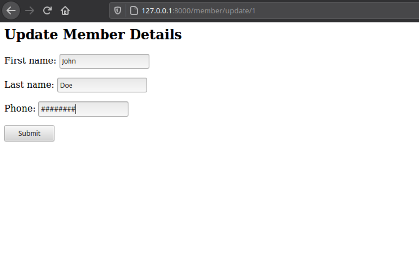

# Django Forms & CRUD

## Working with Django forms in a Django ap

A form is considered to be functional if it meets the following criteria.

- A form should validate the data entered by the user before it goes to the server
- The form should show errors when invalid data has been submitted.
- The form should also inform the user of successful submission.


Working with forms in any application can be a tedious process. Luckily, Django forms take care of all the complicated processes of validation of data, showing error messages and communication to the user when a form is successfully submitted. This tutorial will create a membership application to add, update, read, and delete their data.

- ### Create a directory for the project

    mkdir Forms

If you wish to work in a virtual environment, create and activate a virtual environment for this project. You must have virtualenv installed.

    python3.8 -m venv env
    source env/bin/activate

- ### Install Django using pip

    pip3 install Django

- ### Create a Django project called django_forms

    django-admin startproject django_forms

- ### Create a Django app called members

    cd django_forms
    django-admin startapp members

Add the app to the list of INSTALLED_APPS in `settings.py`

    INSTALLED_APPS = [
    'django.contrib.admin',
    'django.contrib.auth',
    'django.contrib.contenttypes',
    'django.contrib.sessions',
    'django.contrib.messages',
    'django.contrib.staticfiles',
    'members',
]


- ### Create models

We know that a membership application form takes in personal information, so we will create a member model with the following fields:

1. first_name
2. last_name
3. email
4. address
5. phone
6. age

The member’s app has a file `models.py`. Add the following code for the `Member` model.

```
from django.db import models

# Create your models here.
class Member(models.Model):
    first_name = models.CharField(max_length= 30)
    last_name = models.CharField(max_length= 30)
    email = models.EmailField()
    address = models.CharField(max_length= 200)
    phone = models.CharField(max_length= 30)
    age = models.IntegerField(default =0)


    def __str__(self):
        return self.first_name + " " + self.last_name
```
- ### Apply migrations

    python3.8 manage.py makemigrations
    python3.8 manage.py migrate

- ### Forms
A simple HTML form looks like this:
```
<form action=" ">
  <label for="firstname">First name:</label><br>
  <input type="text" id="firstname" name="firstname" value="Enter first name"><br>
  <label for="lastname">Last name:</label><br>
  <input type="text" id="lastname" name="lastname" value="Enter last name"><br><br>
  <input type="submit" value="Submit">
</form> 
```

When rendered on a browser, it looks like this:


- ### Creating Forms from Models
Django forms help the form creation easier since they take care of most of the heavy lifting for us. To use Django forms in our application, we first need to create a file `forms.py` in the members’ directory.

Next, import the `Member model` as well as `forms` from `django`, as shown below.

    from .models import Member
    from django import forms

After the imports, we will then create a class for each form we wish to have. Since we need to have a page that allows members to submit their details, the first form will be a form that accepts user input.
```
from django import forms
from .models import Member

class MemberCreateForm(forms.ModelForm):
    class Meta:
         model = Member
         fields = ("first_name","last_name","email","address","phone","age")
```

The form takes in one parameter `forms.ModelForm`, `forms.ModelForm` is a Django helper class. Since we have already created our fields in the model, there is no need to create the fields again. The inner `Meta` class will tell the application the model and fields we will be using.

- ### Using Forms in Views
Now that we are done with the `MemberCreate` form, we need to render it on a template with the help of generic class-based views. Django provides generic class-based views which handle form processing.

These classes are grouped as follows.


The most commonly used views are :
- Generic display — these are `DetailView` and `ListView`
- Generic editing views - include `FormView`, `CreateView`,`UpdateView`,`DeleteView`

The first class we are going to create is `MemberCreate` view. Open `views.py` and import `Member` Model, `MemberCreateForm` and `CreateView`

    from .models import Member
    from .forms import MemberCreateForm
    from generic.edit.views importCreateView
The `MemberCreate` class takes three properties, namely:
1. model
2. template_name
3. form_class

        class MemberCreate(CreateView):
            model = Member
            template_name = "members/member_create_form.html"
            form_class = MemberCreateForm
Go ahead and create the `member_create_form.html` template, which should be in the template directory of the member’s app.

    members
      -templates
        - members
          -member_create_form.html
Add the following code to the template we created above.
```

<form method="POST">

{{ form.as_p }}
<input type="submit" value="Submit"/>
</form>

```
The tag `{{ form.as_p }}` renders the form using paragraphs while `` protects our forms from CSRF attacks. You can also render the form using `{{form-as_table}}` which renders the form using a table.

- ### Urls
We are almost there to see the form rendered on the browser. The last part is to hook the view in the path of our urls. Update the root `urls.py` file as follows
```
from django.contrib import admin
from django.urls import path,include
urlpatterns = [
path('admin/', admin.site.urls),
path("", include('members.urls')),
]
```
Create a file `members/urls.py` and add the path to `member/create with` the MemberCreate View and set the name to `createmember`.
```
from django.urls import path
from . import views

urlpatterns = [
   path('member/create', views.MemberCreate.as_view(), name="createmember"),
]
```

The form is now complete. If you navigate to `http:localhost:0.0.0.0:8000/members`, you should see the form rendered as we intended.


The criteria for creating all other forms will be the same as the above, which is:

- Create a form class in forms.py and add the necessary properties
- Create a class in views.py and add the required properties
- Create a template for the form
- Hook the view in urls

So let’s create the rest of the forms real quick.

- ### Update and Delete Members Form
A member should also have the option to edit or delete their information, let's take care of that. `Open forms.py` , add the `MemberUpdate` class and specify which fields can be edited.

    class MemberUpdateForm(forms.ModelForm):
       class Meta:
          model = Member
            fields = ("first_name","last_name","phone")
- ### Views
Let’s create the views for rendering. Open `views.py` and import the `UpdateView` and `DeleteView` class from `django.views.generic.edit`.
Create the `MemberUpdate` and `MemberDelete` classes and declare the necessary properties. In the MemberDelete class, we dont need to display any fields.
```
from django.views.generic.edit import CreateView,UpdateView,DeleteView

class MemberUpdate(UpdateView):
    model = Member 
    template_name = "members/member_update_form.html"
    form_class = MemberUpdateForm
     

class MemberDelete(DeleteView):
    model = Member 
    template_name = "members/member_delete_form.html"
    
```
- ### Create the templates
Create the `member_update_form.html` and `member_delete_form.html` in the templates directory

- ### member_update_form.html
```

<h2>Update Member Details</h2>
<form method="post">
<div>
   
  {{ form.as_p }}
  <input type="submit" value="Save" />
</div>
</form>

```

- ### member_delete_form.html
```


<h1>Delete Your Details</h1>

<p>Are you sure you want to delete your details: {{ member }}?</p>

<form action="" method="POST">
  
  <input type="submit" value="Confirm">
</form>


```
- ### Add the Urls
```
from django.urls import path

from . import views

urlpatterns = [
   path('member/create', views.MemberCreate.as_view(), name="createmember"),
   path('member/update/<pk>', views.MemberUpdate.as_view(), name="updatemember"),
   path('member/delete/<pk>', views.MemberDelete.as_view(), name="deletemember"),
  
]
```
Test the forms:



- ### Redirecting

Our forms are working fine, but once submitted, the user should be redirected to another page, lets create a simple homepage that will show all the member details.

Open views.py and create a view that renders the homepage.
```
from django.shortcuts import render


# Create your views here.
def home(request):
    member_details = Member.objects.all()
    context = {"details":member_details}
    return render(request, "members/home.html", context)
```
- ### home.html template
  
```
<!doctype html>
<html>
  <body>
    <h1>All Members</h1>
            
            <hr></hr>
       <li>Names : {{ member.first_name }} {{ member.last_name }} </li>

       <li>Age: {{ member.age }}</li>


  </body>
</html>
```
- #### update the urls.py.
     path('', views.home, name="home"),
- #### Update the views to include a `success_url`
```
<!doctype html>
<html>
  <body>
    <h1>All Members</h1>
            
            <hr></hr>
       <li>Names : {{ member.first_name }} {{ member.last_name }} </li>

       <li>Age: {{ member.age }}</li>


  </body>
</html>
```

You can also use the `get_absolute_url` method in models to provide a redirect link. get_absolute_url is a Django convention that ensures that the user does not resubmit data again.

    #models.py
    def absolute_url(self):
      return “member/list”

If you use `get_absolute_url()` on the `Member` model, you dont need to provide a success_url for `MemberUpdate` or `MemberDelete`

- ### Conclusion
When creating forms with generic views, the data is submitted directly to the model. This ensures that you don’t have to worry about validation, incorrect data since all the heavy lifting has been done for you.

Congratulations, that all you need to create forms in Django. You can read more here on how to add authentication in Django.
