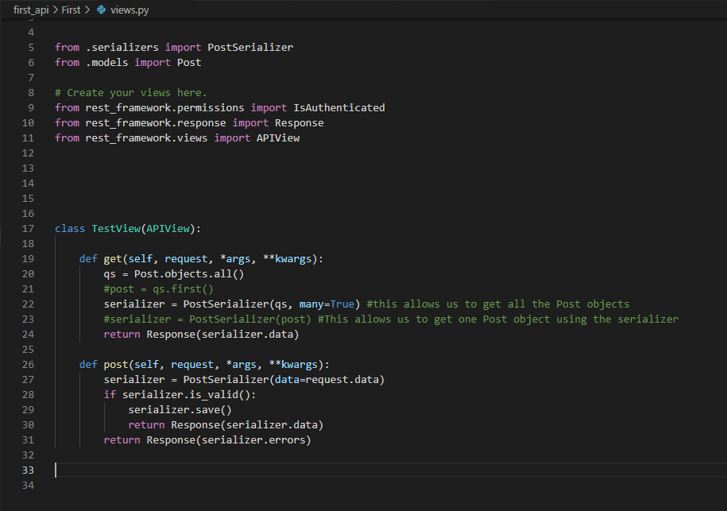
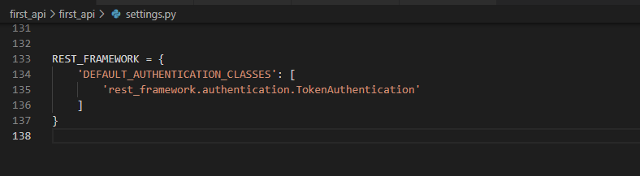

# Django REST Framework & Docker

ay an important role in making software run effectively. As a software developer looking to build systems that solve real problems, building and working with APIs is going to be a routine thing. As such, you will have to rely on frameworks to build functional APIs. One of the biggest and most powerful frameworks for building APIs is the Django Rest Framework (DRF).

As a beginner developer, or as someone who is interested in learning DRF, understanding its infrastructure will make things easier. In this article, we are going to explore the Django Rest Framework and its core concepts.

## What is Django Rest Framework?

Django Rest Framework is a powerful and flexible toolkit for building APIs. An API is a piece of software that allows two applications to communicate. There are many different types of APIs and among them are REST APIs.

## What is REST API?

A REST API is an API that follows the constraints of the RST architectural style. They are also known as RESTful APIs. They allow interaction with RESTful web services by using HTTP methods such as:

- GET – to retrieve resources.
- PUT – to change the state or update resources.
- POST – To create resources.
- DELETE – to remove resources.
  
## Why Django Rest Framework?

There are many benefits associated with using DRF that will make your API building process simple and straightforward.

It comes with extensive documentation. Django Rest Framework’s documentation covers everything from setting up, creating serializers, and handling different types of views. Also, the framework has strong community support from thousands of experienced developers.

It is customizable. Whether you want to customize your models or default theme, DRF makes it possible for you to create APIs the way you want.

It has robust authentication policies. Authentication is one of the most important parts of building functional systems. DRF comes with a robust authentication system that allows you to build secure APIs at all times.

Powerful serialization. Django Rest Framework serialization feature allows you to handle data from models and databases efficiently.

## What are the core concepts of the Django Rest Framework?

1. ### Serializers

Serialization is the process of converting objects in a database so that they can be understood by frontend frameworks.

In simple terms, a serializer will convert data from your database into a human-readable form on the frontend.

Serializers work the same way Django Form and ModelForm classes do. In fact, one of the two major serializers is a ModelSerializer.

A basic model in Django for those who are familiar with it will look like this:

```
from django.conrib.auth import get_user_model
from django.db import models
User = get_user_model()
Class Post(models.Model):
  Title = models.CharField(max_length= 100)
  Description = models.TextField()
  Timestamp = models.DateTimeField(auto_now_add=True)
  Owner = models.ForeignKey(User, on_delete=models.CASCADE)
  Def __str__(self):
    return self.title
```

A serializer class will look like this:

```
from rest_framework import serializers
from .models import Post
class PostSerializer(serializers.ModelSerializer):
    class Meta:
        model = Post
        fields = (
            'title', 
            'description', 
            'owner', 
        )
```

The difference between the two is that while a Django model can stand on its own in a web framework, a serializer has to work with a model to retrieve data.

Serializers also come with a concept known as deserialization which transforms parsed data on the frontend back into the complex type on the database after first validating it.  

2. ### Models

Models are python objects that allow web applications and APIs to access and manage data. They work through classes that define data stores and their properties.

Models can include fields, methods, and metadata.

3. ### Fields

Fields represent a column of data in a database table. So in this case, Post represents a field that you can see on a table. Each field comes with a field type depending on the kind of data you want to store.

4. ### Methods

A method is like a basic python function. The only difference is that while functions can exist on their own, methods belong to classes. This means that they are strictly used for objects with which they are called and are accessible to the data found in the class.

So in this case, the code below is a standard python class method that returns a human-readable string for the class.

```
 def __str__(self):
     return self.title
```

5. ### Metadata

Metadata is a class that is often used to control the default ordering of records you get when you query data from the database.

6. ### Views

Views handle the logic part of your system. The Django Rest Framework has several different concepts you need to understand. These include:

- Function-Based Views
- APIView
- Generic Views
- Mixins
  
7. ### Function-Based Views

Function based views rely on functions to create views. Essentially, you will create a function that executes all the verbs we mentioned above.

Function based views are a great way to offer added customization to your code as you build your API since you can create and follow the sequence of actions described.

Here is an example of a simple function based view.

```
from rest_framework.decorators import api_view
From rest_framework.response import Response 
@api_view()
def hello_world(request):
  Return Response({“message”:”Hello, world!”})
```

As you can see, the code is detailed with each action being fully described before we get a response. One downside of using function based views is that you will have to write a lot of code.

8. ### Class Based Views

Class based views rely on classes to carry out the same functions a function based view would. The only difference is that this time, you will use a lot less code and might actually enjoy working with the Django Rest Framework.

Also, Class based views allow code reusability i.e. the ability to reuse code throughout your software. This principle is known in the software engineering circles as DRY.

There are some important concepts associated with Class based views. These include:
- APIView
- Mixins
- Generics
  

9. ### APIView

The APIView can be considered the simplest wrapper when creating an API endpoint. While the APIView looks similar to @APIView in the function-based view, it differs from the former in that this time it is not a decorator.

A simple APIView function will look like this.



10. ### Mixins

Mixins enable us to create reusable behavior with our code. They carry, with them, a series of actions that will guide the actions of our methods.

Some of the Mixins you are likely to encounter during your work with APIs include:

- ListModelMixins
- CreateModelMixins
- RetrieveModelMixins
- UpdateModelMixins
- DestroyModelixins
  
11. ### Generics

Generics help us cut down even more code from our view functions without interfering with the logic. From our earlier example of function based views, we can create a Class based view by changing the code.

This does not change the function of the code, as it will still work the same way. Yet, it does reduce the amount of code. Just because Class based views use less code does not mean that you cannot customize your code.  

12. ### Authentication

Authentication is the process of assigning credentials to incoming requests.

The Django Rest Framework uses permission and throttling policies to determine whether requests sent to the API will be authorized or not. They are able to perform these important tasks through the credentials provided by the Authentication process.

These credentials are usually placed and assessed before running your code so you’ll always find them at the beginning of a view function.

There are different kinds of authentication schemes you can set up for your API. These include:

- BasicAuthentication – This scheme relies on the user’s Username and Password for authentication. It uses HTTP basic authentication and is best for testing purposes.
- TokenAuthentication- This scheme relies on a simple token-based HTTP Authentication scheme. You’ll usually need to use this form of authentication when dealing with client-server setups, such as native desktop and mobile clients.

- SessionAuthentication – This scheme uses the Django default session backend for authentication. It is most suitable for AJAX clients sharing the same session context with your website.
- RemoteUserAuthentication – The RemoteUserAuthentication relies on your webserver for authentication. This form of authentication is best for creating User objects for usernames that don’t exist.
- CustomAuthentication – The CustomAuthentication scheme allows you to customize your authentication process based on the API you are building.

-  
Additionally, Django also allows you to use third-party authentication resources through their third-party packages for tailor-made authentication for APIs.


## Beginner’s Guide to Docker
- Docker: wat to isolate and run applications.
- The entire environment is isolated. 
- No longer need virtual environemtns. 
- Docker is really just linux containers. 
- Downside to virtual machine: size and speed.
- Virtual environments are used to isolate Python software packages locally.
- Virtual environments are more limited compared to Docker containers.
- Check versions of Docker and Docker Compose:
```
$ docker --version
Docker version 19.03.5, build 633a0ea
$ docker-compose --version
docker-compose version 1.24.1, build 4667896b
```
- use docker info to inspect.
- Only running containers will appear with docker container ls
- Images and containers are the two fundamental concepts to grasp when you start with Docker.
  - image: snapshot in time of what a project contains. 
  - container: running instance of the image.
- Create custom images using a Dockerfile and use docker-compose.yml to run containers. 
- Baking analogy for images and containers concepts:
```
A Dockerfile is the recipe for a cake
An image is a snapshot of the recipe at a given time
A docker-compose.yml says how to make the cake
And the container is the actual, baked cake
```
- Dockerfile: a list of all requirements needed to build our image. 
- Dockerfiles are read from top-to-bottom. 
- Command to build image: docker image build .
- When a change is made to a step, all steps following it will be executed from scratch.
- It is better to put code that will not change at the top and code that will change towards the end. 
- docker-compose.yml: list of container instructions. 
- docker-compose.yml controls how to run the container.

